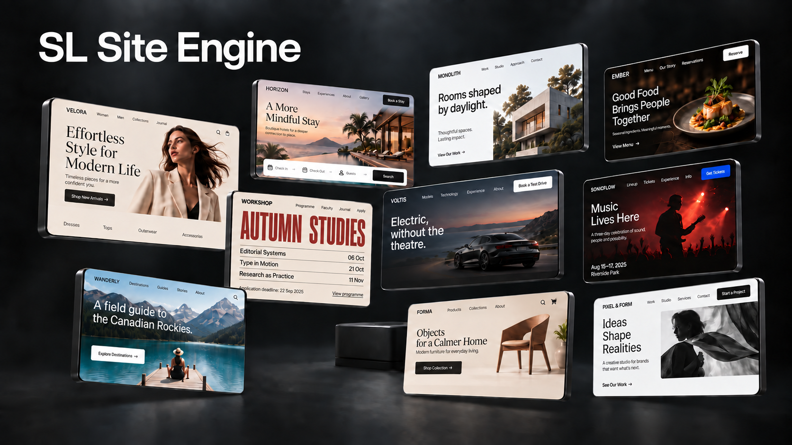
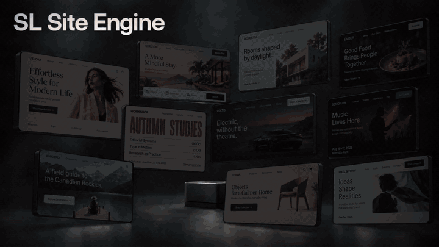

<h1 align="center">SL Site Engine</h1>
<p align="center"><strong>Beyond default pages. New directions for every brief.</strong></p>
<p align="center">A design-exploration skill for Codex — from a short brief to a reference rendered from real code.</p>
<p align="center"><a href="#install">Install</a> · <a href="#the-idea-in-motion">Watch</a> · <a href="#how-it-works">Workflow</a></p>

Build a direction around the business, not a preset. Choose the composition, agree on the content and controls, then see an actual browser screenshot of the proposed page. Generated photography and illustrations can enrich the design; the typography and interface stay editable in code.

This is an early public release. It guides the process and checks fidelity; it does not promise that every output will be beautiful or better than an unassisted result.

## Install

```sh
npx skills add SLtowl/sl-site-engine -g -a codex -y
```

Uses the open-source [skills CLI](https://github.com/vercel-labs/skills). Start a new Codex task after installation, then ask naturally:

> Use $sl-site-engine to create a homepage reference for my bakery. I want a distinctive design, but I haven't chosen a composition yet.

Or explore a set:

> Use $sl-site-engine to explore 10 distinct directions for my product website. Start with the first screen.

Node.js/npm is needed for the installation command and optional development tools. The skill itself is instructions, not a running service. Final references require an agent with local file access and browser rendering; image generation and inspiration search depend on the tools available in your environment. No paid UI plugin is required.

## The idea in motion

[](assets/media/sl-site-engine.mp4)

[Watch or download the full MP4](https://github.com/SLtowl/sl-site-engine/raw/refs/heads/main/assets/media/sl-site-engine.mp4) · 8 seconds · 60 FPS · 1920 × 1080 · silent loop

The cover and film are promotional artwork, not screenshots of generated working websites. The GIF is a lighter preview; the full video is 60 FPS.

## How it works

| Stage | What you see |
| --- | --- |
| Brief | Up to three initial questions about purpose, brand voice, colors, control shape and visual richness. Existing answers are reused. |
| Research | A recommended search for relevant visual ideas, started only with your permission. Quick and Thorough effort modes remain separate choices. |
| Composition | Usually 2–3 visual sketches for one final reference, with a clear difference in focus and reading flow. A requested direction set supplies its own choice. |
| Agreement | A compact content/action map and two density sketches of the selected direction: calmer and richer. With a connected component library, 2–3 real button variants and a recommendation. |
| Reference | The chosen design built with real fonts, separate assets and editable HTML/CSS, then captured in a browser at the declared viewport. |
| Refinement | A local correction changes that layer; rejecting the whole direction reopens composition. Accepted choices and frozen comparisons are preserved. |

Expressive is the starting point, not a requirement to add more decoration. You can choose a restrained design or explicitly delegate choices. The skill does not repeatedly ask for decisions you have already made.

**Quick** shows the first checked set. **Thorough** adds one bounded internal revision cycle, not endless regeneration. Optional research never starts merely because Thorough was selected.

## Code-faithful by construction

The **final reference** is a screenshot of its actual implementation, not concept art to reconstruct later. Fonts, editable text, controls, spacing, crops and layout already exist in the prototype. Generated media can supply a subject, texture or illustration — not the finished interface.

An early sketch may use generated imagery to explore composition and is labelled accordingly; it is not a pixel-fidelity promise. A browser reference matches the supplied code at its recorded viewport, fonts, assets and browser conditions — not every device or later edit. Responsive layouts, backend, payments and real ordering flows are separate work unless requested.

See [reference fidelity](skill/sl-site-engine/references/fidelity.md) and [media strategy](skill/sl-site-engine/references/media-strategy.md).

## Anti-slop gate

No fabricated reviews, prices, metrics or guarantees presented as real. No generated image passed off as a working interface. No claimed UI-library provenance without real components.

Decorative section numbers and tiny captions attached to ornamental lines are excluded. Useful prices, dates, ordered steps, navigation and accessibility indicators remain available. Other visual choices — palette, rounding, meaningful icons, illustration and pattern richness — follow the brief.

The review also checks composition, visible subject scale, natural copy, usable actions and integration of imagery. Removing every detail is not the goal. There is no numerical beauty guarantee or claim of eliminating all AI slop.

The complete gate is documented in [the anti-slop reference](skill/sl-site-engine/references/anti-slop.md). Sets of three or more directions also pass a deterministic manifest audit for deep-axis diversity, asset paths, fonts, and visible-element rationale.

## Development

```sh
npm install
npm run verify
```

`npm run verify` runs skill-resource checks, direction-audit tests and repository/media integrity checks. It does not regenerate the cover or film. These technical checks do not measure aesthetic superiority.

```sh
npm run motion:studio
npm run motion:poster
npm run motion:render
```

The installable skill lives in `skill/sl-site-engine/`, separate from promotional media. It works without SL UI Library; if you select [SL UI Library](https://github.com/SLtowl/sl-ui-library) or another connected library, the agent must inspect real components and disclose anything unavailable.

The film source is in `motion/`; the MP4 is H.264, 1920 × 1080, 60 FPS, 480 frames, eight seconds, without audio. See [media provenance](assets/media/PROVENANCE.md). Also by SL: [Graphite Dashboard Design](https://github.com/SLtowl/graphite-dashboard-design).

## License

[MIT](LICENSE).
